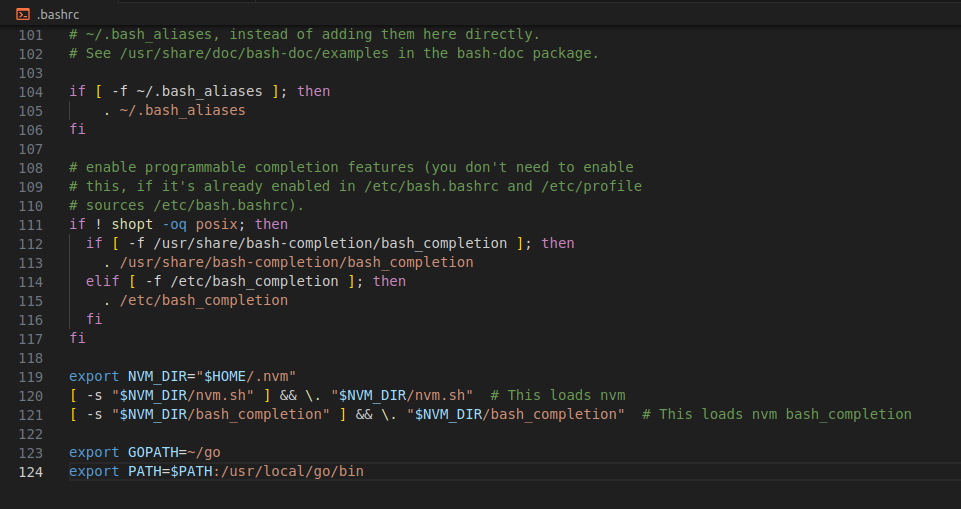

# Hyperledger fabric 설치 이전 환경 세팅
## Virtual box 설치
```
https://download.virtualbox.org/virtualbox/7.0.8/VirtualBox-7.0.8-156879-Win.exe
```
## Ubuntu 20.04 LTS 데스크톱 설치
```
https://releases.ubuntu.com/focal/?_ga=2.41973733.1395950567.1698105350-1115410103.1697717554
```
## 운영체제 구현 방법
```
https://youtu.be/x5MhydijWmc?si=ZNSjuhY4XvVO9v6d
```
## 필요한 코드
```
sudo apt install build-essential dkms linux-headers-$(uname -r)
```
## Curl, docker, docker-compose 설치(apt)
### apt 서버 패키지 업데이트 목록 작성
```
sudo apt update
```
### Curl 외 설치
```
sudo apt install curl jq tree vim net-tools -y
```
```
sudo apt install build-essential software-properties-common libssl-dev -y
```
### Docker 설치
```
sudo apt install docker.io docker-compose -y
```
### 현재 접속중인 사용자에게 권한주기
```
sudo usermod -aG docker $USER
```
```
echo $USER
```
### 리부팅
```
sudo reboot
```
## NodeJS 설치 (nvm -> NodeJS v18)
### nvm 설치
```
curl https://raw.githubusercontent.com/creationix/nvm/v0.39.1/install.sh | bash
```
### 소스 적용
```
source ~/.profile
```
### NodeJS 18버전 적용
```
nvm install v18
```
### NodeJS 버전확인
```
node -v
```

## GoLang 설치 (tar 다운로드 -> 설정)
### GoLang 1.20.10 압축파일 불러오기
```
curl -OL https://go.dev/dl/go1.20.10.linux-amd64.tar.gz
```
### GoLang 압축파일 풀기
```
tar -xvf go1.20.10.linux-amd64.tar.gz
```
### Go 패키지를 usr/local에 저장
```
sudo mv go /usr/local
```
### 저장 확인
```
tree /usr/local/go/bin
```

## GoLang 환경번수 설정


### 위의 사진과 같이 .bashrc 파일에 아래의 코드 작성
```
export GOPATH=~/go
export PATH=$PATH:/usr/local/go/bin
```
### .bashrc 파일 변경사항 저장
```
source ~/.bashrc
```
### GoLang 버전확인
```
go version
```

## Python, Git 설치(Ubuntu 기본설치)
### Python 버전확인
```
python --version
```
### Git 버전확인
```
git --version
```