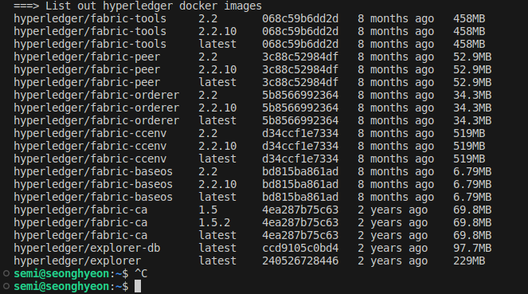

# Hyperledger Fabric 설치
## Hyperledger Fabric v2.2 LTS 설치
```
curl -sSL https://bit.ly/2ysbOFE | bash -s -- 2.2.10 1.5.2
```

설치가 완료되면 hyperledger fabric images가 설치됩니다.

### docker 이미지 확인
```
docker images
```

## Fabric Path 환경변수 등록


### GoLang Path와 동일하게 .bashrc 파일에 아래의 코드 작성
```
export GOPATH=~/go
export PATH=$PATH:/usr/local/go/bin:~/fabric-samples/bin
```
### .bashrc 파일 변경사항 저장
```
source ~/.bashrc
```
### peer 버전확인
```
peer version
```