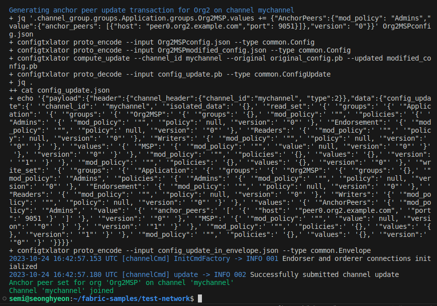
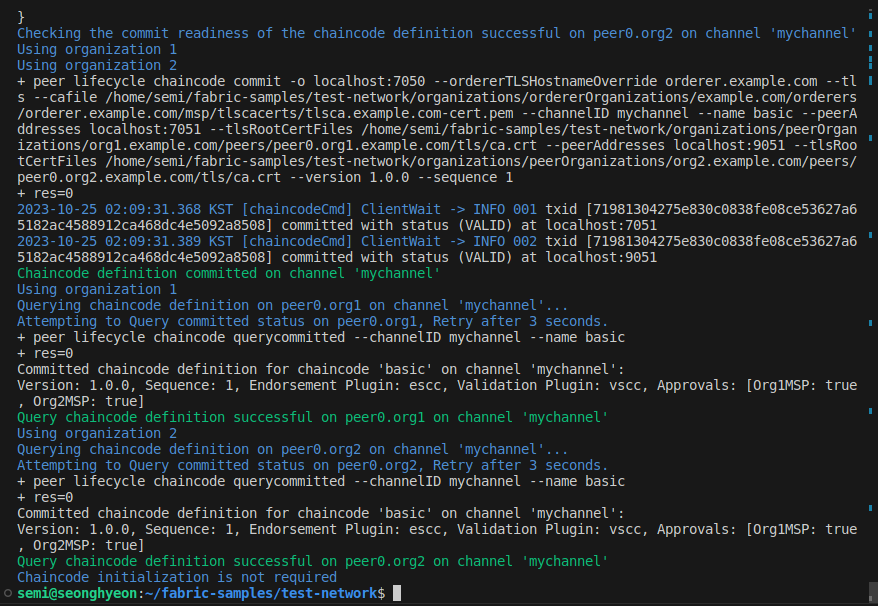

# Hyperledger Fabric 예제 (asset-transfer-basic) 수행하기
## docker 기본 사용 명령어
### 도커 이미지 조회
```
docker images
```
### 도커 컨테이너 조회
```
docker ps -a
```
### 실행중인 도커 네트워크 조회
```
docker network ls
```
### 도커 컨테이너 초기화
```
docker rm -f $(docker ps -aq)
```
### 도커 이미지 초기화
```
docker rmi -f $(docker images dev-* -q)
```
### 도커 네트워크 초기화
```
docker network prune
```
## test-network 수행
### fabric-samples/test-network 폴더로 이동
```
cd ~/fabric-samples/test-network
```
### test-network 실행 및 couchdb 생성
```
./network.sh up -ca -s couchdb
```
### Channel 생성
```
./network.sh createChannel
```


Channel 생성 성공 시 위의 사진과 같이 "Channel 'mychannel' joined" 문구가 생깁니다.

### test-network 정보 자세히보기
```
docker network inspect fabric_test 
```

### peer0.org1 정보 확인
```
docker logs peer0.org1.example.com
```

### peer0.org2 정보 확인
```
docker logs peer0.org2.example.com
```

### asset-transfer-basic 체인코드 설치 배포


아래의 코드를 실행할 경우 위의 사진과 같이 성공되었음을 볼 수 있습니다.
```
./network.sh deployCC -ccn basic -ccp ../asset-transfer-basic/chaincode-go/ -ccl go -ccv 1.0.0
```
## NodeJS 어플리케이션 수행
### javascript 어플리케이션으로 이동
```
cd ~/fabric-samples/asset-transfer-basic/application-javascript
```
### node-modules 설치
```
npm install
```
### app.js 실행
```
node app.js
```