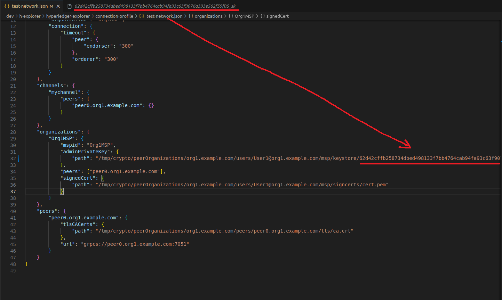

# Hyperledger Explorer 실습
## h-explorer 예시 코드 불러오기 및 실행
### dev 폴더 생성
```
mkdir ~/dev
```
### dev 폴더로 이동
```
cd ~/dev
```
### Explorer 실습 예시 불러오기
```
git clone https://github.com/saarc/h-explorer.git
```
### h-explorer 폴더로 이동
```
cd h-explorer
```
### Git버전 2.2로 변경
```
git checkout 2.2
```
## Key 설정
### Key 조회하기
```
ls ~/fabric-samples/test-network/organizations/peerOrganizations/org1.example.com/users/User1@org1.example.com/msp/keystore/
```
### test-network.json에 key삽입 및 저장


key 조회를 통해 나온 key값을 위의 사진처럼 KEY_REPLACEMENT 부분에 삽입 및 저장

## Explorer Docker 실행
### 실행 폴더 경로로 이동
```
cd ~/dev/h-explorer/hyperledger-explorer
```
### Docker 실행
```
docker-compose up -d
```
### 실행 확인
```
docker logs explorer.mynetwork.com
```